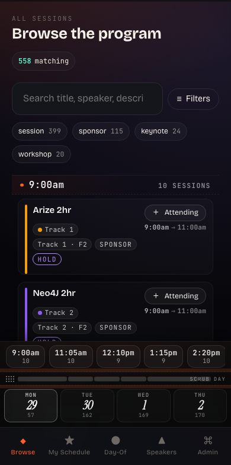
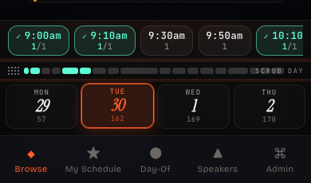

# WFSF

A mobile-first PWA for building your personal schedule at the **AI Engineer World's Fair 2026** (San Francisco, Jun 29 – Jul 2). 554 sessions across 9+ parallel tracks, surfaced as a tappable plan you can build in under 10 minutes and use on-floor when conference Wi-Fi misbehaves.

<p align="center">
  
  &nbsp;&nbsp;&nbsp;
  
</p>

## What's inside

- **Faceted browse** over the full conference program — search, day tiles, type chips, plus a bottom sheet for Track (49) and Room (17) with live faceted counts.
- **Bottom-anchored day chrome**: time pills, a proportional duration scrubber, and selectable day tiles — all in the thumb zone.
- **Drag-to-scrub timeline** with a floating lens that names the slot under your finger and shows attending/backup/conflict state per slot.
- **Attending / Backup** model: tap once to attend, switch to backup if you change your mind. Conflicts highlight automatically.
- **OTP login via email** (Resend). No passwords. Session tokens are httpOnly cookies.
- **Admin role** seeded from `ADMIN_EMAILS` — can manage account state but never sees user itineraries. Audit-logged.
- **Auto-sync** of session/speaker JSON every 60 min (15 min during the event window).

## Stack

| Layer | Tech |
|---|---|
| Backend | FastAPI · Starlette · APScheduler |
| Templates | Jinja2 (server-rendered, HTMX-driven partial swaps) |
| Frontend | HTMX · AlpineJS (sparingly) · vanilla CSS |
| DB | SQLite (WAL, FK, single-writer) |
| Email | Resend (OTP delivery) |
| Hashing | argon2-cffi |
| Deps | uv via `pyproject.toml` |

No build step, no JS framework, no service worker.

## Running locally

Requires Python 3.11+ and [uv](https://docs.astral.sh/uv/).

```bash
# 1. Create venv and install
python -m venv .venv
source .venv/bin/activate
uv pip install -e .

# 2. Configure (copy and edit)
cp .env.example .env  # or create one — see below

# 3. Run (defaults to port 10000, host 0.0.0.0, reload on)
python -m app
```

Open `http://localhost:10000/` — first email you log in with becomes a regular user; admins are seeded from `ADMIN_EMAILS`.

### Environment

Minimal `.env`:

```ini
SESSION_SECRET=change-me-something-random-and-long
RESEND_API_KEY=re_yourkey
RESEND_FROM=WFSF <onboarding@resend.dev>
ADMIN_EMAILS=you@example.com

# optional overrides
APP_BASE_URL=http://localhost:10000
APP_PORT=10000
DEV_OTP_LOG=true   # prints OTP to server log for dev
```

`DEV_OTP_LOG=true` will print OTP codes to the server log instead of (or in addition to) sending email — useful when iterating without burning Resend credits.

## Project layout

```
app/
├── __main__.py        # python -m app → uvicorn on port 10000
├── main.py            # FastAPI app, middleware (security headers, cache-control)
├── config.py          # Pydantic settings, .env loader
├── db.py              # SQLite connection + schema bootstrap
├── auth.py            # OTP issue/verify, session create/destroy
├── sync.py            # Pulls sessions/speakers JSON from ai.engineer
├── sched.py           # APScheduler — periodic sync
├── queries.py         # Read queries — facets, slot grouping, itinerary
├── templating.py      # Jinja env, filters, static_v() cache-bust helper
├── routers/           # browse, my_schedule, dayof, speakers, profile, admin, auth
├── templates/         # base.html, page templates, partials/
└── static/
    ├── css/ (app · filters · agenda)
    └── js/  (app · htmx.min)
```

## Caching

Static assets ship with a SHA1-hashed query string (`?v=abc1234567`) computed once per `(path, mtime)` pair, then cached `immutable` for a year. HTML is `no-store` so any UI change is visible on next nav — no manual hard-refresh ritual. See `app/templating.py:static_v()` and `app/main.py:CacheControlMiddleware`.

## Security notes

- OTP codes are HMAC-SHA256 hashed at rest, single-use, short-lived, rate-limited per email and per IP.
- Sessions are httpOnly, SameSite cookies; server-side store with revocation on sign-out.
- All read queries are scoped `WHERE user_id = :session_user`; user IDs are never accepted from client input.
- Admin actions are audit-logged. You cannot disable/demote the last remaining active admin.
- CSP, HSTS, X-Content-Type-Options, X-Frame-Options, Referrer-Policy applied via middleware.

## Status

Personal project, single conference. Not actively accepting contributions — the codebase is small and opinionated enough that forks are encouraged over PRs.

## License

MIT — do whatever you want with it.
